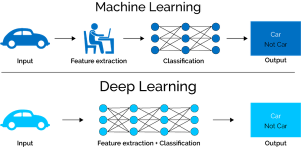

# 1. Importing basics 
```python
import pandas as pd
import numpy as np
import matplotlib.pyplot as plt
%matplotlib inline  
import seaborn as sns
%load_ext autoreload
%autoreload 2
```
  

# 2. Scaling Features  

## 2.1 MinMaxScaler  
  
```python
from sklearn.preprocessing import MinMaxScaler
normalizer = MinMaxScaler() 
normalizer.fit(df[['columns']])
df['columns'] = normalizer.transform(df[['columns']])
```

## 2.2 RobustScaler  

```python
from sklearn.preprocessing import RobustScaler

# Instanciate Robust Scaler
r_scaler = RobustScaler()

# Fit scaler to feature
r_scaler.fit(df[['columns']])

# Scale
df['columns'] = r_scaler.transform(df[['columns']])
```

# 3. Encoding

## 3.1 Label Encoder

```python
from sklearn.preprocessing import LabelEncoder
le = LabelEncoder()
le.fit(df['column'])
df['column'] = le.transform(df['column'])
```

## 3.2 OneHotEncoder

```python
from sklearn.preprocessing import OneHotEncoder

ohe = OneHotEncoder(sparse = False)
ohe.fit(df[['columns']])
oh = ohe.transform(df[['columns']])

df["column1"],df["column2"],df['column3'] = oh.T
```

# 4. HoldOut  
  
## 4.1 Training Split  

> Define **X**,**y** first
```python
from sklearn.model_selection import train_test_split  
X_train, X_test, y_train, y_test = train_test_split(X,y, test_size=0.3) #X, y used here
```  
  

# 5. Machine Learning 


# Supervised Learning Model   

## 5.1 Regression  
  
### 5.1.1 LinearRegression
```python
from sklearn.linear_model import LinearRegression
model = LinearRegression()
model.fit(X_train, y_train)
print(model.coef_)  ## => View the model's slope (a)
print(model.intercept_)  ## => View the model's intercept (b)
model.score(X_test, y_test)
```
  
### 5.1.2 KNNRegressor  
  
```python
from sklearn.neighbors import KNeighborsRegressor 
neigh = KNeighborsRegressor(n_neighbors=2)  #fix k value inside *n_neighbors* parameter  
neigh.fit(X_train, y_train)  ## => Require X_train, y_train from Hold Out method
neigh.score(X_test,y_test)  ## => Require X_test, y_test from Hold Out method
neigh.predict(new_X) ## => new_X : vector of feature to predict
```  

## 5.2 Classification 
  
### 5.2.1 LogisticRegression  
```python
from sklearn.linear_model import LogisticRegression
log_model = LogisticRegression()
log_model.fit(X_train, y_train)  ## => Require X_train, y_train from Hold Out method
log_model.score(X_train,y_train)  ## => Require X_test, y_test from Hold Out method
log_model.predict(new_X) ## => new_X : vector of feature to predict  
```
  
### 5.2.2 KNNClassifier

```python
from sklearn.neighbors import KNeighborsClassifier
kneigh = KNeighborsClassifier(n_neighbors=10) ## ==> K = 10 neighbors
kneigh.fit(X_train, y_train)  ## => Require X_train, y_train from Hold Out method
kneigh.score(X_test,y_test)  ## => Require X_test, y_test from Hold Out method
kneigh.predict(new_X) ## => new_X : vector of feature to predict
```

# Un-Supervised Learning Model   

## 5.3 Principal Component Analysis (PCA)

To complete...

## 5.4 Clustering with K-Means algorithm

To complete...

## 5.5 Time Series (ARIMA, SARIMA, SARIMAX)

To complete...

## 5.6 Natural Language Processing

To complete...

# 6 Model Tuning  
  
## 6.1 Grid Search  

> Grid Search with KNN Classifier
```python
from sklearn.model_selection import GridSearchCV
knn_class = KNeighborsClassifier()
grid = {'n_neighbors':[5,10,20,30]}  ## => Hyperparameter Grid
grid_search = GridSearchCV(knn_class, grid, scoring = 'accuracy', cv = 5, n_jobs=-1) # paralellize computation 
grid_search.fit(X_train,y_train);
print(f"1. Best Score :  {grid_search.best_score_}")  ## => Best Score regarding scoring defined above
print(f"2. Params (K):{grid_search.best_params_}")
print(f"3. Best Estimator : {grid_search.best_estimator_}")
```  
  
  
## 6.2 Random Search  
  
> Random Search with KNN Classifier
```python
from sklearn.model_selection import RandomizedSearchCV
from sklearn.neighbors import KNeighborsClassifier
knn_class = KNeighborsClassifier()
random_param = {'n_neighbors':[1, 5, 10, 15, 20], 'p':[1,2,3]} ## => Hyperparameter Grid
random_search = RandomizedSearchCV(knn_class, random_param, scoring = 'recall', n_iter=5, cv = 5, n_jobs=-1) # paralellize computation 
random_search.fit(X_train,y_train);
print(f"1. Best Score :  {random_search.best_score_}")  ## => Best score (related to scoring metric)
print(f"2. Params (K):{random_search.best_params_}")  ## => Best params
print(f"3. Best Estimator : {random_search.best_estimator_}")  
```  

# 7. Pipeline
## 7.1 Pipeline Example
```python
from sklearn.pipeline import Pipeline
from sklearn.preprocessing import MinMaxScaler
from sklearn.impute import SimpleImputer

pipe = Pipeline([
    ('imputer', SimpleImputer()),
    ('scaling', MinMaxScaler())
])

pipe.fit_transform(data[['age']])
```
## 7.2 Export Pipeline and model "Pickle"

```python
import pickle

# Export pipeline as pickle file
with open("pipeline.pkl", "wb") as file:
    pickle.dump(tuned_pipe, file )

# Load pipeline from pickle file
my_pipeline = pickle.load(open("pipeline.pkl","rb"))
my_pipeline
my_pipeline.predict(X_test.iloc[0:1])

```


# 8. Deep Learning



## 8.1 Standard NN models

Cleaning Data, Scaling features, Train/Test Split could be needed before building the model.

### 8.1.1 Regression

```python

#Init model

from tensorflow.keras import Sequential, layers

model = Sequential()
model.add(layers.Dense(50, activation='relu', input_shape=(x1,x2,x3))) # put the dimensions of X.shape for x1,x2,x3 
model.add(layers.Dense(25, activation='relu')) # ReLU activation is the prefered default activation fonction
model.add(layers.Dense(25, activation='relu'))
model.add(layers.Dense(10, activation='relu'))
model.add(layers.Dense(1, activation='linear')) # put the numbers of targeted value expected. Here is the linear activation for Regression

#Compile model
model.compile(loss='mse',          # The loss is calculated with the MSE function
              optimizer='adam',    # Adam optimizer is the default prefered optimizer for this task.
              metrics=['mae'])     # Mean Absolute Error is metric of the model "accuracy"

#Fit model
from tensorflow.keras.callbacks import EarlyStopping                  ## import EarlyStopping if wanted to stop before all the epochs iterations.
es = EarlyStopping(patience=5, restore_best_weights=True, verbose=1)  ## define the number of patience (retries before stopping the iteration epohcs) 

model.fit(X_train,                ## doing the fit on the train data
          y_train,                ## doing the fit on the train data
          validation_split=0.3,   ## Validation set (here split the 30% of the train data)
          epochs=100,             ## Number of epochs to iterate (the EarlyStopping should stop before arriving at the end if find optimum acu)
          batch_size=16,          ## Number of batch size. Slice the data to adjust weights
          callbacks = [es])       ## Calling EarlyStopping

#Evaluate the model
model.evaluate(X_test, y_test, verbose=1)  ## Evaluate the model with the test set

```

### 8.1.2 Classification (2 Classes)

```python

#Init model

from tensorflow.keras import Sequential, layers

model = Sequential()
model.add(layers.Dense(50, activation='relu', input_shape=(x1,x2,x3))) # put the dimensions of X.shape for x1,x2,x3 
model.add(layers.Dense(25, activation='relu')) # ReLU activation is the prefered default activation fonction
model.add(layers.Dense(25, activation='relu'))
model.add(layers.Dense(10, activation='relu'))
model.add(layers.Dense(1, activation='sigmoid')) # Activation could be softmax with 2 neurones.

#Compile model
model.compile(loss='binary_crossentropy',  # The loss is calculated with the binary_crossentropy parameter
              optimizer='adam',            
              metrics=['accuracy'])

#Fit model
from tensorflow.keras.callbacks import EarlyStopping                  ## import EarlyStopping if wanted to stop before all the epochs iterations.
es = EarlyStopping(patience=5, restore_best_weights=True, verbose=1)  ## define the number of patience (retries before stopping the iteration epohcs) 


model.fit(X_train,                ## doing the fit on the train data
          y_train,                ## doing the fit on the train data
          validation_split=0.3,   ## Validation set (here split the 30% of the train data)
          epochs=100,             ## Number of epochs to iterate (the EarlyStopping should stop before arriving at the end if find optimum acu)
          batch_size=16,          ## Number of batch size. Slice the data to adjust weights
          callbacks = [es])       ## Calling EarlyStopping

#Evaluate the model
model.evaluate(X_test, y_test, verbose=1)  ## Evaluate the model with the test set

```

### 8.1.3 Multi-Classification (more than 2 Classes)

```python

#Init model

from tensorflow.keras import Sequential, layers

model = Sequential()
model.add(layers.Dense(50, activation='relu', input_shape=(x1,x2,x3))) # put the dimensions of X.shape for x1,x2,x3 
model.add(layers.Dense(25, activation='relu')) # ReLU activation is the prefered default activation fonction
model.add(layers.Dense(25, activation='relu'))
model.add(layers.Dense(10, activation='relu'))
model.add(layers.Dense(5, activation='softmax')) # Number of neurones correspond to the number of categorical values to classify

#Compile model
model.compile(loss='categorical_crossentropy',   # The loss is calculated with the categorical_crossentropy parameter
              optimizer='adam',
              metrics=['accuracy'])

#Fit model
from tensorflow.keras.callbacks import EarlyStopping                  ## import EarlyStopping if wanted to stop before all the epochs iterations.
es = EarlyStopping(patience=5, restore_best_weights=True, verbose=1)  ## define the number of patience (retries before stopping the iteration epohcs) 


model.fit(X_train,                ## doing the fit on the train data
          y_train,                ## doing the fit on the train data
          validation_split=0.3,   ## Validation set (here split the 30% of the train data)
          epochs=100,             ## Number of epochs to iterate (the EarlyStopping should stop before arriving at the end if find optimum acu)
          batch_size=16,          ## Number of batch size. Slice the data to adjust weights
          callbacks = [es])       ## Calling EarlyStopping

#Evaluate the model
model.evaluate(X_test, y_test, verbose=1)  ## Evaluate the model with the test set
```

## 8.2 Convolutional NN models

Cleaning Data, Scaling features, Train/Test Split could be needed before building the model.

### 8.2.1 Regression

```python
from tensorflow.keras import Sequential, layers

#Init model

model = Sequential()

# First convolution & max-pooling
model.add(layers.Conv2D(16, (4,4), strides=(2,2), input_shape=(28, 28, 1), activation='relu', padding='same')) ## Define neurones/filter, kernel_matrix, strides, input_shape, activation, padding 
model.add(layers.MaxPool2D(pool_size=(2,2))) ## Pool size for the MaxPooling. Could call an Average Pool function instead of max

# Second convolution & max-pooling
model.add(layers.Conv2D(32, (3,3), strides=(2,2), activation='relu', padding='same'))
model.add(layers.MaxPool2D(pool_size=(2,2)))

# Flattening
model.add(layers.Flatten())  ## Flatten the previous output 

# One fully connected
model.add(layers.Dense(100, activation='relu'))  ## First connected layer/Hidden Layer

# Last layer (let's say a regression with 1 target/output) 
model.add(layers.Dense(1, activation='linear'))  ## Final Output layer of the model

#Compile model
model.compile(loss='mse',          # The loss is calculated with the MSE function
              optimizer='adam',    # Adam optimizer is the default prefered optimizer for this task.
              metrics=['mae'])     # Mean Absolute Error is metric of the model "accuracy"

#Fit model
from tensorflow.keras.callbacks import EarlyStopping                  ## import EarlyStopping if wanted to stop before all the epochs iterations.
es = EarlyStopping(patience=5, restore_best_weights=True, verbose=1)  ## define the number of patience (retries before stopping the iteration epohcs) 

model.fit(X_train,                ## doing the fit on the train data
          y_train,                ## doing the fit on the train data
          validation_split=0.3,   ## Validation set (here split the 30% of the train data)
          epochs=100,             ## Number of epochs to iterate (the EarlyStopping should stop before arriving at the end if find optimum acu)
          batch_size=16,          ## Number of batch size. Slice the data to adjust weights
          callbacks = [es])       ## Calling EarlyStopping

#Evaluate the model
model.evaluate(X_test, y_test, verbose=1)  ## Evaluate the model with the test set

```

### 8.2.2 Classification (2 Classes)

```python

#Init model

from tensorflow.keras import Sequential, layers

model = Sequential()

# First convolution & max-pooling
model.add(layers.Conv2D(16, (4,4), strides=(2,2), input_shape=(28, 28, 1), activation='relu', padding='same')) ## Define neurones/filter, kernel_matrix, strides, input_shape, activation, padding 
model.add(layers.MaxPool2D(pool_size=(2,2))) ## Pool size for the MaxPooling. Could call an Average Pool function instead of max

# Second convolution & max-pooling
model.add(layers.Conv2D(32, (3,3), strides=(2,2), activation='relu', padding='same'))
model.add(layers.MaxPool2D(pool_size=(2,2)))

# Flattening
model.add(layers.Flatten())  ## Flatten the previous output 

# One fully connected
model.add(layers.Dense(100, activation='relu'))  ## First connected layer/Hidden Layer

# Last layer (let's say a regression with 1 target/output) 
model.add(layers.Dense(1, activation='sigmoid')) # Activation could be softmax with 2 neurones.

#Compile model
model.compile(loss='binary_crossentropy',  # The loss is calculated with the binary_crossentropy parameter
              optimizer='adam',            
              metrics=['accuracy'])

#Fit model
from tensorflow.keras.callbacks import EarlyStopping                  ## import EarlyStopping if wanted to stop before all the epochs iterations.
es = EarlyStopping(patience=5, restore_best_weights=True, verbose=1)  ## define the number of patience (retries before stopping the iteration epohcs) 


model.fit(X_train,                ## doing the fit on the train data
          y_train,                ## doing the fit on the train data
          validation_split=0.3,   ## Validation set (here split the 30% of the train data)
          epochs=100,             ## Number of epochs to iterate (the EarlyStopping should stop before arriving at the end if find optimum acu)
          batch_size=16,          ## Number of batch size. Slice the data to adjust weights
          callbacks = [es])       ## Calling EarlyStopping

#Evaluate the model
model.evaluate(X_test, y_test, verbose=1)  ## Evaluate the model with the test set

```

### 8.2.3 Multi-Classification (more than 2 Classes)

```python

#Init model

from tensorflow.keras import Sequential, layers

model = Sequential()

# First convolution & max-pooling
model.add(layers.Conv2D(16, (4,4), strides=(2,2), input_shape=(28, 28, 1), activation='relu', padding='same')) ## Define neurones/filter, kernel_matrix, strides, input_shape, activation, padding 
model.add(layers.MaxPool2D(pool_size=(2,2))) ## Pool size for the MaxPooling. Could call an Average Pool function instead of max

# Second convolution & max-pooling
model.add(layers.Conv2D(32, (3,3), strides=(2,2), activation='relu', padding='same'))
model.add(layers.MaxPool2D(pool_size=(2,2)))

# Flattening
model.add(layers.Flatten())  ## Flatten the previous output 

# One fully connected
model.add(layers.Dense(100, activation='relu'))  ## First connected layer/Hidden Layer

# Final Output layer
model.add(layers.Dense(5, activation='softmax')) # Number of neurones correspond to the number of categorical values to classify

#Compile model
model.compile(loss='categorical_crossentropy',   # The loss is calculated with the categorical_crossentropy parameter
              optimizer='adam',
              metrics=['accuracy'])

#Fit model
from tensorflow.keras.callbacks import EarlyStopping                  ## import EarlyStopping if wanted to stop before all the epochs iterations.
es = EarlyStopping(patience=5, restore_best_weights=True, verbose=1)  ## define the number of patience (retries before stopping the iteration epohcs) 


model.fit(X_train,                ## doing the fit on the train data
          y_train,                ## doing the fit on the train data
          validation_split=0.3,   ## Validation set (here split the 30% of the train data)
          epochs=100,             ## Number of epochs to iterate (the EarlyStopping should stop before arriving at the end if find optimum acu)
          batch_size=16,          ## Number of batch size. Slice the data to adjust weights
          callbacks = [es])       ## Calling EarlyStopping

#Evaluate the model
model.evaluate(X_test, y_test, verbose=1)  ## Evaluate the model with the test set
```

## 8.3 Recurrent NN models

Cleaning Data, Scaling features, Padding values, Train/Test Split could be needed before building the model.

### 8.3.1 Regression

```python
from tensorflow.keras import Sequential, layers


#Init model

model = Sequential()


# Choosing LTSM or GRU or both...

########################
###       LSTM       ###
########################
model.add(layers.Masking(mask_value=0.))             ## Adding mask if padding values (shoul correspond to value inputed in padding)
model.add(layers.LSTM(units=20, activation='tanh'))  # !!! USE 'TANH' BY DEFAULT RATHER THAN 'RELU'


########################
###       GRU        ###
########################
model.add(layers.GRU(units=27, activation='tanh'))
model.add(layers.Masking(mask_value=0.))                 ## Adding mask if padding values (shoul correspond to value inputed in padding)

# Last layer (let's say a regression with 1 target/output) 
model.add(layers.Dense(1, activation='linear'))  ## Final Output layer of the model.

#Compile model
model.compile(loss='mse',            # The loss is calculated with the MSE function
              optimizer='rmsprop',   # Here, by default, use 'rmsprop' rather than 'adam'
              metrics=['mae'])       # Mean Absolute Error is metric of the model "accuracy"


#Fit model
from tensorflow.keras.callbacks import EarlyStopping                  ## import EarlyStopping if wanted to stop before all the epochs iterations.
es = EarlyStopping(patience=5, restore_best_weights=True, verbose=1)  ## define the number of patience (retries before stopping the iteration epohcs) 

model.fit(X_train,                ## doing the fit on the train data
          y_train,                ## doing the fit on the train data
          validation_split=0.3,   ## Validation set (here split the 30% of the train data)
          epochs=100,             ## Number of epochs to iterate (the EarlyStopping should stop before arriving at the end if find optimum acu)
          batch_size=16,          ## Number of batch size. Slice the data to adjust weights
          callbacks = [es])       ## Calling EarlyStopping

#Evaluate the model
model.evaluate(X_test, y_test, verbose=1)  ## Evaluate the model with the test set

```

### 8.3.2 Classification (2 Classes)

```python

#Init model

from tensorflow.keras import Sequential, layers

model = Sequential()

# Choosing LTSM or GRU or both...

########################
###       LSTM       ###
########################
model.add(layers.Masking(mask_value=0.))             ## Adding mask if padding values (shoul correspond to value inputed in padding)
model.add(layers.LSTM(units=20, activation='tanh'))  # !!! USE 'TANH' BY DEFAULT RATHER THAN 'RELU'


########################
###       GRU        ###
########################
model.add(layers.GRU(units=27, activation='tanh'))
model.add(layers.Masking(mask_value=0.))                 ## Adding mask if padding values (shoul correspond to value inputed in padding)


# Last layer (let's say a regression with 1 target/output) 
model.add(layers.Dense(1, activation='sigmoid'))        # This layer depends on your task, as usual

#Compile model
model.compile(loss='binary_crossentropy',  # The loss is calculated with the binary_crossentropy parameter
              optimizer='rmsprop',         # Here, by default, use 'rmsprop' rather than 'adam'
              metrics=['accuracy'])

#Fit model
from tensorflow.keras.callbacks import EarlyStopping                  ## import EarlyStopping if wanted to stop before all the epochs iterations.
es = EarlyStopping(patience=5, restore_best_weights=True, verbose=1)  ## define the number of patience (retries before stopping the iteration epohcs) 


model.fit(X_train,                ## doing the fit on the train data
          y_train,                ## doing the fit on the train data
          validation_split=0.3,   ## Validation set (here split the 30% of the train data)
          epochs=100,             ## Number of epochs to iterate (the EarlyStopping should stop before arriving at the end if find optimum acu)
          batch_size=16,          ## Number of batch size. Slice the data to adjust weights
          callbacks = [es])       ## Calling EarlyStopping

#Evaluate the model
model.evaluate(X_test, y_test, verbose=1)  ## Evaluate the model with the test set

```

### 8.3.3 Multi-Classification (more than 2 Classes)

```python

#Init model

from tensorflow.keras import Sequential, layers

model = Sequential()

# Choosing LTSM or GRU or both...

########################
###       LSTM       ###
########################
model.add(layers.Masking(mask_value=0.))             ## Adding mask if padding values (shoul correspond to value inputed in padding)
model.add(layers.LSTM(units=20, activation='tanh'))  # !!! USE 'TANH' BY DEFAULT RATHER THAN 'RELU'


########################
###       GRU        ###
########################
model.add(layers.GRU(units=27, activation='tanh'))
model.add(layers.Masking(mask_value=0.))                 ## Adding mask if padding values (shoul correspond to value inputed in padding)

# Last layer (let's say a regression with 1 target/output) 
model.add(layers.Dense(10, activation='softmax')) # This layer depends on your task, as usual

#Compile model
model.compile(loss='categorical_crossentropy',   # The loss is calculated with the categorical_crossentropy parameter
              optimizer='rmsprop',               # Here, by default, use 'rmsprop' rather than 'adam'
              metrics=['accuracy'])

#Fit model
from tensorflow.keras.callbacks import EarlyStopping                  ## import EarlyStopping if wanted to stop before all the epochs iterations.
es = EarlyStopping(patience=5, restore_best_weights=True, verbose=1)  ## define the number of patience (retries before stopping the iteration epohcs) 


model.fit(X_train,                ## doing the fit on the train data
          y_train,                ## doing the fit on the train data
          validation_split=0.3,   ## Validation set (here split the 30% of the train data)
          epochs=100,             ## Number of epochs to iterate (the EarlyStopping should stop before arriving at the end if find optimum acu)
          batch_size=16,          ## Number of batch size. Slice the data to adjust weights
          callbacks = [es])       ## Calling EarlyStopping

#Evaluate the model
model.evaluate(X_test, y_test, verbose=1)  ## Evaluate the model with the test set
```


# 9. Data Sourcing
## 9.1 API

```python
import requests

BASE_URI = "<insert base URI/URL>" ## => Look into API Documentation to find BASE_URI
path = "<insert path>" ## => Look into API Documentation to find path of requested data
params = {
    'query': <insert query>,
    'format': 'json'  ## => if needed to specify the format for the API call
}
response = requests.get(BASE_URI+path, params).json()
```

## 9.2 Web Scraping

```python
import requests
from bs4 import BeautifulSoup

BASE_URI = "<insert base URI/URL>" ## => Place the URL you want to Scrape
path = "<insert path>" ## => behind URL if needed to scrape several pages for example
response = requests.get(BASE_URI+path, headers={"<Put some headers>"})  ## => headers could be needed to specify language content in return
soup = BeautifulSoup(response.content, "html.parser")

## iterate inside soup to find the corresponding tag in which is stored the desired content.
## Example below for books
for book in soup.find_all("article", class_="product_pod"):
    title = book.find("h3").find("a").string
    price = float(book.find(class_="price_color").string.strip('£'))
    for rate, value in ratings.items():
        if book.find(class_="star-rating "+rate) != None:
            rating = value
    title_list.append(title)
    price_list.append(price)
    rating_list.append(rating)

```

## Others

### Checking values to JSON file

```python

import json
check_values = {col:df[col].value_counts().tolist() for col in df.columns} ## the DataFrame is called 'df' here

with open('check_values.json', 'w') as outfile:
    json.dump(check_values, outfile)

```