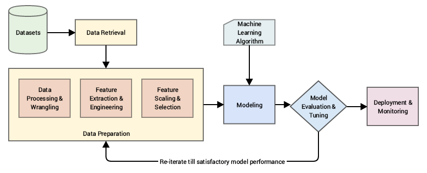

# 1. Importing basics 
```python
import pandas as pd
import numpy as np
import matplotlib.pyplot as plt
%matplotlib inline  
import seaborn as sns
%load_ext autoreload
%autoreload 2
```
  

# 2. Scaling Features  

## 2.1 MinMaxScaler  
  
```python
from sklearn.preprocessing import MinMaxScaler
normalizer = MinMaxScaler() 
normalizer.fit(df[['columns']])
df['columns'] = normalizer.transform(df[['columns']])
```

## 2.2 RobustScaler  


# 3. Encoding

## 3.1 Label Encode

```python
from sklearn.preprocessing import LabelEncoder
le = LabelEncoder()
le.fit(df['column'])
df['column'] = le.transform(df['column'])
```

## 3.2 OneHotEncode

```python
from sklearn.preprocessing import OneHotEncoder

ohe = OneHotEncoder(sparse = False)
ohe.fit(df[['columns']])
oh = ohe.transform(df[['columns']])

df["column1"],df["column2"],df['column3'] = oh.T
```

# 4. HoldOut  
  
## 4.1 Training Split  

> Define **X**,**y** first
```python
from sklearn.model_selection import train_test_split  
X_train, X_test, y_train, y_test = train_test_split(X,y, test_size=0.3) #X, y used here
```  
  
# 5. Model   

## 5.1 Regression  
  
### 5.1.1 LinearRegression  
  
### 5.1.2 KNNRegressor  
  
```python
from sklearn.neighbors import KNeighborsRegressor 
neigh = KNeighborsRegressor(n_neighbors=2)  #fix k value inside *n_neighbors* parameter  
neigh.fit(X, y)
```  


## 5.2 Classification 
  
### 5.2.1 LogisticRegression  
  
  
### 5.2.2 KNNClassifier  
  
# 6 Model Tuning  
  
## 6.1 Grid Search  
  
```python
from sklearn.model_selection import GridSearchCV
```  
  
  
## 6.2 Random Search  
  
```python
from sklearn.model_selection import RandomizedSearchCV
```  

